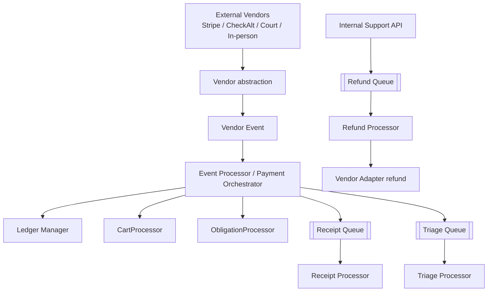
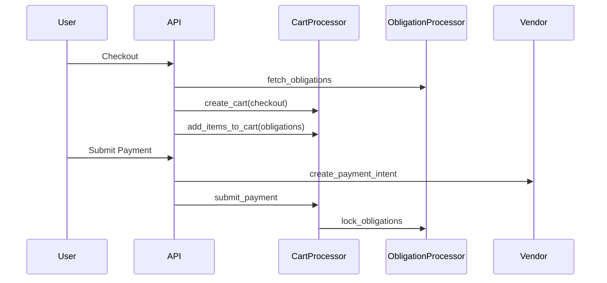
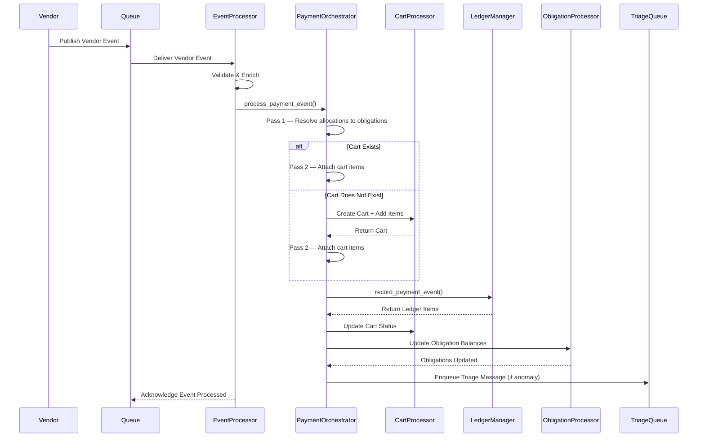
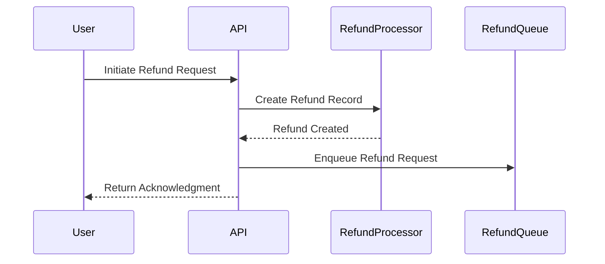
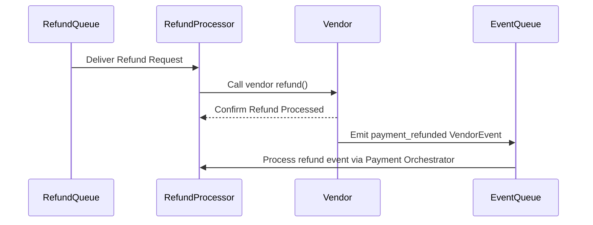
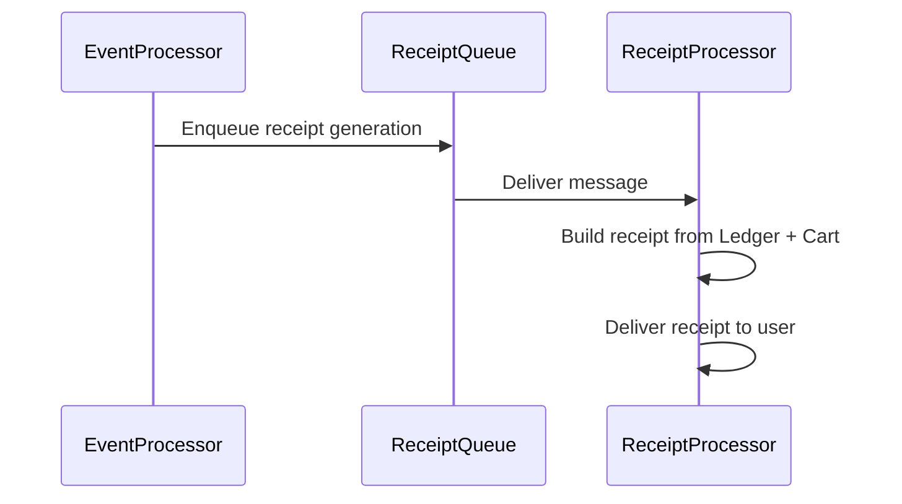

# Summary

The **Gringotts payment system** introduces a **cart-centric, ledger-driven financial architecture** that replaces the legacy citation-centric model with a more flexible, auditable, and vendor-agnostic design.

At its core, the system separates:

- **payment intent** (Cart)
- **financial liability** (Obligation)
- **actual money movement** (Ledger)

This enables accurate modeling of scenarios such as **partial payments, refunds, disputes, court adjustments, and multi-obligation checkouts**.

The system integrates with external vendors (e.g., Stripe, CheckAlt) through a **vendor abstraction layer**, processes vendor events asynchronously, and ensures financial correctness through a **ledger-first model** where all monetary state is derived from immutable records.

---

# Core Domain Components

Detailed Data Model and Transitions: [Core Data Model](https://www.notion.so/Core-Data-Model-3129ccb8874f80b187f3e72a56419664?pvs=21)

### Cart

Represents a user's **payment intent**.

- Groups one or more obligations into a single checkout session
- Manages lifecycle: `draft → checkout → payment_submitted → payment_confirmed → payment_settled`
- Acts as the anchor for a payment attempt — all ledger entries, allocations, and vendor events trace back to a cart
- Created on checkout; may also be created on-the-fly by the Event Processor when a vendor event lacks one (e.g., check payments)
- Tracks vendor, payment mode, total amount, and refund state

---

### Obligation

Represents a **financial liability** owed by an owner (e.g., a citation fee, late fee, flagging fee).

- Tracks `amount`, `allocated_total`, `outstanding_amount`, `overpaid_amount`, and `waived_amount`
- Lifecycle: `open → locked → closed` (standard path); also supports `waived`, `superseded`, `disputed`, `voided`
- Locked when a payment is submitted; closed when fully paid
- Supports partial payments, adjustments, and waiver workflows
- Each obligation is linked to a cart via a **CartItem**, which records the amount being paid for that obligation in that cart

---

### CartItem

The join between a **Cart** and an **Obligation**.

- Records exactly how much of an obligation is being paid in a given checkout
- Used by the Ledger to allocate money precisely to obligations
- Created when items are added to a cart; also created on-the-fly during event processing for check/court payments

---

### Transaction

Represents a **normalised, system-level financial record** produced by a vendor.

- Abstracts vendor-specific transaction formats (Stripe Balance Transaction, CheckAlt record)
- Contains a **payment breakdown** (base amount, fees) and **allocations** (which cart items were paid)
- Linked to a VendorEvent; stored independently for reporting and reconciliation

---

### Vendor Event

Represents a **normalised external signal** from a payment vendor.

- Derived from vendor webhooks (Stripe), file drops (CheckAlt), or API reconciliation
- Carries the transaction, cart, and allocation information needed by the Event Processor
- Event types: `payment_confirmed`, `payment_settled`, `payment_refunded`, `payment_dispute_opened`, `payment_dispute_won`, `payment_dispute_lost`
- Drives all asynchronous state transitions across the system

---

### Ledger

The **source of truth for all money movement**.

- Immutable, append-only records — entries are never modified
- Each record captures: amount, fees, vendor, timestamps (`confirmed_at`, `settled_at`), and status
- Stages: `payment_confirmed → payment_settled → refunded / dispute_*`
- All financial reporting and reconciliation is derived from ledger entries

---

### Ledger Allocation

Links a **Ledger entry to a specific CartItem (and therefore Obligation)**.

- Records exactly how much of a payment was applied to each obligation
- Enables accurate tracking of partial payments, multi-obligation carts, and per-item refunds
- Required for per-citation reporting and reconciliation

---

### Refund

Represents an internally initiated refund request.

- Stores which cart items are being refunded and for how much
- Lifecycle: `pending → processed → failed`
- Consumed by the Refund Processor, which calls the vendor and emits a `payment_refunded` Vendor Event

---

### Triage Request

Flags an inconsistency or anomaly for manual investigation.

- Created by the Triage Processor when automated validation fails
- Examples: unresolvable allocations, overpayments, mismatched amounts

---

# Key Architectural Concepts

### Public API

The user-facing HTTP layer that handles checkout and payment submission.

**Responsibilities:**
- Validates user identity and obligation eligibility
- Orchestrates cart creation, item addition, and checkout via the **CartProcessor**
- Calls the vendor to create a payment intent (e.g., Stripe PaymentIntent) and submits payment via the **CartProcessor**, which locks obligations via the **ObligationProcessor**
- Returns immediately — all downstream processing is asynchronous

**Emits:** Cart and obligation state changes; access logs for every request

---

### Internal Support API

Operational HTTP endpoints for staff-facing workflows.

**Responsibilities:**
- Initiating refunds (creates a Refund record and enqueues it)
- Obligation adjustments: waive, partial waive, supersede
- Viewing triage requests and resolving anomalies
- Triggering on-demand reconciliation or reports

**Emits:** Audit logs with before/after snapshots for all mutations

---
### 6. ObligationProcessor

Owns obligation state and financial balance tracking.

**Key operations:**
- `create_obligation()` — creates a new open obligation
- `lock_obligation()` — marks obligation as locked against a cart
- `update_obligation_on_payment()` — updates `allocated_total`, `outstanding_amount`, and status on payment events
- `waive_obligation()` / `partial_waive_obligation()` — applies waivers
- `supersede_obligation()` — closes the obligation and creates a replacement with a revised amount
- `get_valid_obligation_against_payable()` — resolves a payable identifier to an obligation 

Every operation emits an `ObligationActivityLog` for the audit trail.

---

### 5. CartProcessor

Owns the cart state machine and all cart persistence.

**Key operations:**
- `create_cart()` — creates a cart in `draft` or `system_created` status
- `add_items_to_cart()` — creates `CartItem` records linking obligations to the cart
- `checkout_cart()` — advances status to `checkout`
- `submit_payment()` — advances to `payment_submitted`; calls ObligationProcessor to lock obligations

Every operation emits an `CartActivityLog` for the audit trail.

---

### Vendor Layer

Encapsulates all external integrations. The core system has no vendor-specific imports — all vendor logic is isolated here. The core system has no vendor imports — every vendor signal enters the core pipeline as a normalised `VendorEvent`.

Each vendor module has 3 responsibilities:

| Responsibility | |
|---|---|
| **Ingestion** | Ingest data from external vendor. This may be through webhooks, polling or any other way |
| **Generate Transaction** |Create a system Transaction against an external vendor transaction.  |
| **Emit Vendor Event** | Create and emit vendor events for gringotts to ingest (settlement, dispute creation etc). |
| **Vendor Adapter** | Implements a cendor adaptor wrapper to interface with any vendor functionality like requesting refunds. |

Current vendors: **Stripe** (online card), **CheckAlt** (check/ACH), Courts, Leo ( in_person ) See [Vendor Integration](vendor-integration.md) for basic design for stripe vendor.

---
### Ledger Manager

Owns all reads and writes to the immutable financial ledger.

**Responsibilities:**
- `record_payment_event()`: Creates a new LedgerItem and its LedgerAllocations from a VendorEvent
- Ensures ledger entries are never modified — only new entries are appended

---

### Event Processor

Consumes the vendor events emitted by the vendor layer

**Responsibilities:**
- resolves allocations
- records ledger entries
- triggers downstream workflows
- Creates a cart on-the-fly if the vendor event does not reference one (common for check payments) using **Cart Manager**
- Calls the **Ledger manager** to record the financial event
- Updates cart status via **CartProcessor**
- Updates obligation balances and status via **ObligationProcessor**
- Enqueues a triage message if anomalies are detected
- Enqueues a Reciept message if  needed

---

### Refund Processor

Processes refund requests.

**Flow:**
1. Internal Support API creates a Refund record and enqueues it
2. Refund Processor dequeues the request, calls the Vendor Adapter (`refund()`)
3. Vendor confirms; emits a `payment_refunded` VendorEvent
4. Event Processor picks up the VendorEvent, updates ledger and obligation balances

---

### Triage Processor

Audits system behaviour by detecting anomalies that require human review.

**Detects:**
- Allocations that cannot be resolved to an obligation
- Overpayments or underpayments against expected amounts
- Vendor events referencing unknown carts or obligations
- Inconsistencies between ledger totals and obligation balances

**Output:** Creates a TriageRequest; notifies the support team via the Triage Queue

---

### Lifecycle / State Machine Processor

Manages time-based and long-running workflows that the synchronous API cannot handle.

**Responsibilities:**
- Cart abandonment: moves `checkout` carts to `abandoned` after timeout

---

### Reporting System

Generates financial and operational insights from the immutable ledger.

**Capabilities:**
- Ledger-based settlement reports (filtered by `settled_at`)
- Audit summaries from AuditLog records

---

### Receipt Processor

Generates user-facing receipts triggered by Event Processor outcomes.

**Types:** payment confirmation, settlement, refund

**Flow:** Event Processor → Receipt Queue → Receipt Processor → build from Ledger + Cart → deliver to user

 ---
### Async Processing (Queues)

Decouples ingestion from processing across all async workflows.

| Queue | Producer | Consumer |
|---|---|---|
| Vendor Event Queue | Vendor Layer (webhooks, sync) | Event Processor / Payment Orchestrator |
| Refund Queue | Internal Support API | Refund Processor |
| Triage Queue | Payment Orchestrator, Triage Processor | Triage Processor |
| Lifecycle Queue | Scheduler / cron | Lifecycle Processor |
| Receipt Queue | Event Processor | Receipt Processor |

---

# Supporting Systems

### Access Logs

Capture API and worker execution details for debugging and monitoring.

- Recorded on every HTTP request and async worker execution
- Fields: `channel`, `request_id`, `correlation_id`, `actor`, `method`, `path`, `status_code`, `duration_ms`, `error_code`

---

### Audit Logs

Capture business-level state changes with full before/after snapshots.

- Recorded on every mutation to a domain entity (Cart, Obligation, Refund, etc.)
- Fields: `domain`, `action`, `entity_type`, `entity_id`, `actor`, `status`, `reason`, `before_state`, `after_state`
- Linked via `correlation_id` and `causation_id` for end-to-end traceability

---

### Correlation & Causation Tracking

Enable tracing of workflows across asynchronous boundaries.

- `correlation_id`: Identifies the full user-initiated flow (e.g., `cart_payment:123`)
- `causation_id`: Identifies the immediate trigger of a state change (e.g., `vendor_event:456`, `http_request:req_xyz`)
- Both IDs propagate through all logs, making it possible to reconstruct the full history of any payment

---

# System Characteristics

- **Event-driven:** state transitions are triggered by vendor events and async jobs
- **Eventually consistent:** state converges through asynchronous processing
- **Ledger-backed:** financial truth is derived from immutable ledger entries
- **Idempotent:** processors safely handle retries and duplicate events via deduplication
- **Vendor-agnostic:** vendor-specific logic is isolated in the vendor layer; the core has no vendor imports
- **Auditable:** every state change is captured with before/after snapshots and correlation tracking
- **Observable:** every request and worker execution is logged with latency, status, and error codes

---

---

# System Sample Outputs

---

# Sequence Diagrams

## Online Cart Payment

## Event Processor

## Refunds

## Receipt Generator

