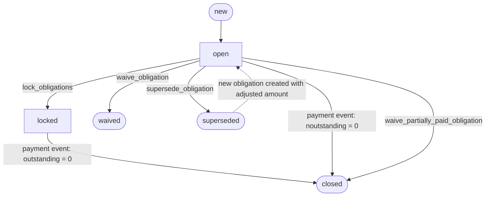
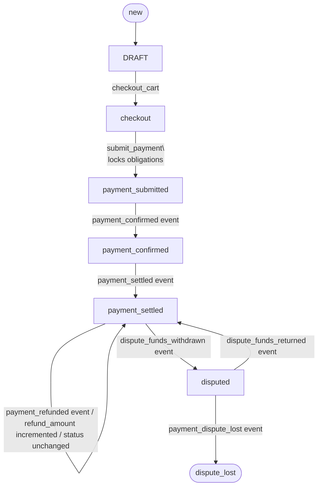

# Gringotts Data Models

---

## Obligation

### ObligationStatus

| Value | Description |
| --- | --- |
| `open` | Obligation is active and has an outstanding balance |
| `locked` | Obligation is reserved for an in-progress payment (locked by a cart) |
| `closed` | Obligation is fully resolved — either fully paid or the remainder was waived |
| `waived` | Obligation was waived in full; no payment was made |
| `superseded` | Obligation has been replaced by a new obligation with an adjusted amount |
| `voided` | Obligation was cancelled entirely in case of clerical error |
| `disputed` | Obligation is under active dispute |

### Obligation Status Transitions

> `superseded`, `voided`, and `waived` are terminal statuses
> 

---

### ObligationEventType

| Value | Description |
| --- | --- |
| `obligation.created` | A new obligation was created |
| `obligation.locked` | Obligation was locked to a cart in preparation for payment |
| `obligation.payment_confirmed` | Payment confirmed; obligation allocation updated |
| `obligation.payment_settled` | Payment settled; allocation finalised |
| `obligation.payment_refunded` | Payment was refunded; allocation reversed |
| `obligation.waived` | Obligation was waived in full (no prior payments) |
| `obligation.partially_waived` | Remaining balance was waived after partial payment |
| `obligation.update` | General update — no status change |
| `obligation.payment_dispute_funds_withdrawn` | Dispute opened; funds withdrawn from merchant |
| `obligation.payment_dispute_funds_return` | Dispute resolved; funds returned to merchant |
| `obligation.superseded` | Obligation replaced by a new one with an adjusted amount |

---

### ObligationLabel

| Value | Description |
| --- | --- |
| `citation_fee` | Primary fee associated with a citation |
| `late_fee` | Late payment penalty |
| `flagging_fee` | Fee for flagging a vehicle |
| `convenience_fee` | Vendor-charged processing or convenience fee |

---

### ObligationOwnerType

| Value | Description |
| --- | --- |
| `citation` | Obligation belongs to a citation |
| `cart` | Obligation belongs to a cart (e.g. a convenience fee added at checkout) |
| `flag` | Obligation belongs to a vehicle flag |

---

### Obligation

| Field | Type | Required |
| --- | --- | --- |
| owner_id | string | yes |
| owner_type | `citation` | `cart` | `flag` | yes |
| label | ObligationLabel | yes |
| status | ObligationStatus | yes |
| amount | int | yes |
| allocated_total | int | yes |
| outstanding_amount | int | yes |
| overpaid_amount | int | yes |
| waived_amount | int | default `0` |
| locked_by | int | optional — cart ID that holds the lock |
| id | int | yes |

> `outstanding_amount = amount − allocated_total`. When `outstanding_amount` reaches `0`, the obligation moves to `closed`. When `allocated_total > amount`, the excess is captured in `overpaid_amount`.
> 

---

### ObligationActivityLog

| Field | Type | Required |
| --- | --- | --- |
| obligation_id | int | yes |
| old_status | ObligationStatus | yes |
| new_status | ObligationStatus | yes |
| status_updated | bool | yes |
| allocated_total | int | yes |
| outstanding_amount | int | yes |
| overpaid_amount | int | yes |
| waived_amount | int | yes |
| allocated_delta | int | yes — change in allocated_total for this event |
| event_type | ObligationEventType | yes |
| locked_by | int | optional |
| ledger_item_id | int | optional |
| vendor_event_id | int | optional |
| transaction_id | int | optional |
| cart_item_id | int | optional |
| payment_mode | `online` | `check` | `court` | optional |

---

## Cart

### CartStatus

| Value | Description |
| --- | --- |
| `draft` | Cart created but not yet populated or submitted |
| `system_created` | Cart auto-created by the system (e.g. for check or court payments) |
| `abandoned` | Cart was abandoned during checkout before payment was submitted |
| `checkout` | Cart has been checked out and is ready for payment submission |
| `payment_submitted` | Payment submitted to the vendor; associated obligations are locked |
| `payment_confirmed` | Vendor has confirmed receipt of payment |
| `payment_settled` | Payment has been fully settled and cleared |
| `disputed` | Payment is under dispute; funds have been withdrawn by the vendor |
| `dispute_lost` | Dispute resolved against the merchant; funds permanently taken |

### Cart Status Transitions

> Refunds do not change cart status. Each `payment_refunded` vendor event increments `cart.refund_amount`. To see which items were refunded, query `RefundItemAllocation` records for the cart.
> 
> 
> Disputes cover the entire cart. Won → `payment_settled` (funds returned). Lost → `dispute_lost` (terminal, funds permanently taken).
> 

---

### CartEventType

| Value | Description |
| --- | --- |
| `cart.created` | Cart was created |
| `cart.items_modified` | Items were added to or removed from the cart |
| `cart.status_transitioned` | Cart status changed (e.g. on payment submission) |
| `cart.checkedout` | Cart was checked out by the user |
| `cart.settled` | Cart payment was fully settled |
| `cart.payment_confirmed` | Vendor confirmed the cart payment |
| `cart.payment_refunded` | Cart payment was refunded; `cart.refund_amount` incremented |
| `cart.dispute_funds_withdrawn` | Dispute filed; funds withdrawn from the merchant |
| `cart.dispute_funds_returned` | Dispute resolved in merchant's favour; funds returned |
| `cart.dispute_lost` | Dispute resolved against the merchant; `dispute_lost` status set |

---

### Cart

| Field | Type | Required |
| --- | --- | --- |
| payment_mode | `online` | `check` | `court` | yes |
| vendor | `stripe` | `checkalt` | yes |
| status | CartStatus | yes |
| amount | int | yes |
| cart_items | List[CartItem] | default `[]` |
| refund_amount | int | default `0` — cumulative total refunded; compare against `amount` to determine full vs partial refund |
| id | int | optional |

---

### CartItem

| Field | Type | Required |
| --- | --- | --- |
| cart_id | int | yes |
| amount | float | yes |
| obligation | Obligation | yes |
| id | int | optional |

> To determine which items were refunded, query `RefundItemAllocation` records linked to this cart. Cart items can only be refunded in full.
> 

---

### CartActivityLog

| Field | Type | Required |
| --- | --- | --- |
| cart_id | int | yes |
| event_type | CartEventType | yes |
| old_status | CartStatus | yes |
| amount | int | yes |
| status_updated | bool | yes |
| metadata | Dict | default `{}` |
| new_status | CartStatus | optional |
| vendor_reference_id | string | optional |
| vendor_reference_type | string | optional |
| vendor_event_id | int | optional |

---

### CartPayable

A lightweight obligation descriptor used when adding fee-type items (e.g. convenience fees) directly to a cart without a pre-existing obligation.

| Field | Type | Required |
| --- | --- | --- |
| type | string | yes |
| amount | float | yes |
| status | ObligationStatus | yes |
| label | ObligationLabel | yes |

---

## Transaction

### TransactionBreakdownType

| Value | Description |
| --- | --- |
| `payment` | Represents the principal payment amount |
| `fee` | Represents a fee charged (e.g. a stripe fee) |

---

### Transaction

Represents a single payment transaction received from a vendor, including how the total amount breaks down and how it is allocated across obligations.

| Field | Type | Required |
| --- | --- | --- |
| vendor_name | `stripe` | `checkalt` | yes |
| vendor_reference_id | string | yes |
| vendor_reference_type | string | yes |
| amount | int | yes |
| payment_breakdown | List[TransactionBreakdownItem] | yes |
| item_allocations | List[TransactionItemAllocation] | default `[]` |
| id | int | optional |

---

### TransactionBreakdownItem

A single line in the payment breakdown (e.g. one entry for the payment amount, one for the fee).

| Field | Type | Required |
| --- | --- | --- |
| type | `TransactionBreakdownType`  | yes |
| amount | float | yes |
| label | string | optional |

---

### TransactionBreakdownType

| Value | Description |
| --- | --- |
| `payment` | Represents the principal payment amount |
| `fee` | Represents a fee charged (e.g. a stripe fee) |

### TransactionItemAllocation

Specifies how a portion of a transaction is allocated to a particular obligation or cart item.

| Field | Type | Required |
| --- | --- | --- |
| allocation_type | `TransactionAllocationType`  | yes |
| amount | int | yes |
| owner_id | string | optional — required when allocation_type is `payable` |
| owner_type | string | optional — required when allocation_type is `payable` |
| label | string | optional — required when allocation_type is `payable` |
| cart_item_id | int | optional — required when allocation_type is `cart_item`  |

### TransactionAllocationType

| Value | Description |
| --- | --- |
| `cart_item` | Allocation is tied to a specific cart item by ID |
| `payable` | Allocation is resolved by matching obligation owner/label identifiers |

### TransactionAttempt

Result of an attempted payment transaction with a vendor.

| Field | Type | Required |
| --- | --- | --- |
| transaction_result | bool | yes |
| failure_reason | string | optional |
| transaction | Transaction | optional |

---

## Ledger

### LedgerStage

| Value | Description |
| --- | --- |
| `ledger.payment_confirmed` | Recorded when a vendor confirms payment |
| `ledger.payment_settled` | Recorded when payment clears/settles |
| `ledger.payment_refunded` | Recorded when a refund is issued |
| `ledger.payment_dispute_funds_withdrawn` | Recorded when dispute funds are withdrawn |
| `ledger.payment_dispute_funds_returned` | Recorded when dispute is resolved and funds returned |

---

### LedgerItem

A single line item in the financial ledger, tied to a specific cart and stage of a payment lifecycle.

| Field | Type | Required |
| --- | --- | --- |
| vendor_name | `stripe` | `checkalt` | yes |
| amount | float | yes |
| stage | `LedgerStage` | yes |
| type | `payment` | `fee` | yes |
| label | string | yes |
| cart | Cart | yes |
| confirmed_at | int (timestamp) | optional |
| settled_at | int (timestamp) | optional |
| allocations | List[LedgerAllocation] | optional |
| transaction | Transaction | optional |
| id | int | optional |

---

### LedgerAllocation

Maps a ledger item to a specific cart item, recording how much of the ledger amount is attributed to each obligation.

| Field | Type | Required |
| --- | --- | --- |
| ledger_id | int | yes |
| cart_item | CartItem | yes |
| amount | float | yes |

---

### LedgerReportItem

Flattened view of a ledger entry used for reporting.

| Field | Type | Required |
| --- | --- | --- |
| payment_date | string | yes |
| vendor_name | string | yes |
| vendor_reference_type | string | yes |
| vendor_reference_id | string | yes |
| transaction_id | int | yes |
| cart_id | int | yes |
| payment_mode | string | yes |
| type | string | yes |
| label | string | yes |
| amount | float | yes |
| owner_type | string | optional |
| owner_id | string | optional |
| obligation_id | int | optional |
| obligation_label | string | optional |
| cart_item_id | int | optional |

---

## Vendor Events

### VendorName

| Value | Description |
| --- | --- |
| `stripe` | Stripe — online card payment gateway |
| `checkalt` | CheckAlt — check/ACH payment processor |

---

### VendorEventType

| Value | Description |
| --- | --- |
| `payment_confirmed` | Vendor confirms the payment has been received |
| `payment_settled` | Vendor confirms the payment has cleared/settled |
| `payment_refunded` | Vendor has processed a refund |
| `payment_dispute_created` | A chargeback or dispute has been opened |
| `payment_dispute_funds_withdrawn` | Disputed funds have been withdrawn from the merchant |
| `payment_dispute_funds_returned` | Dispute resolved in merchant's favour; funds returned |
| `payment_dispute_lost` | Dispute resolved against the merchant; funds not returned |

### Vendor Event → System Actions

| Vendor Event | Cart Status | Obligation Event | Ledger Stage |
| --- | --- | --- | --- |
| `payment_confirmed` | `payment_confirmed` | `obligation.payment_confirmed` | `ledger.payment_confirmed` |
| `payment_settled` | `payment_settled` | `obligation.payment_settled` | `ledger.payment_settled` |
| `payment_refunded` | *(no change — `refund_amount` incremented)* | `obligation.payment_refunded` | `ledger.payment_refunded` |
| `payment_dispute_funds_withdrawn` | `disputed` | `obligation.payment_dispute_funds_withdrawn` | `ledger.payment_dispute_funds_withdrawn` |
| `payment_dispute_funds_returned` | `payment_settled` | `obligation.payment_dispute_funds_return` | `ledger.payment_dispute_funds_returned` |
| `payment_dispute_lost` | `dispute_lost` | *(no obligation event)* | *(no ledger entry)* |

---

### VendorEventProcessingStatus

| Value | Description |
| --- | --- |
| `pending` | Event has been received but not yet processed |
| `processed` | Event was successfully processed |
| `failed` | Event processing encountered an error |

---

### VendorEvent

Inbound event from a payment vendor, driving downstream updates to carts, obligations, and the ledger.

| Field | Type | Required |
| --- | --- | --- |
| processing_status | VendorEventProcessingStatus | yes |
| event_type | VendorEventType | yes |
| vendor_name | `stripe` | `checkalt` | yes |
| metadata | Dict[string, string] | yes |
| transaction | Transaction | optional |
| court_adjustment | CourtAdjustment | optional |
| cart | Cart | optional |
| payment_mode | `online` | `check` | `court` | optional |
| is_settled | bool | optional |
| id | int | required |

---

## Payment

### PaymentMode

| Value | Description |
| --- | --- |
| `online` | Online card payment (processed via Stripe) |
| `check` | Payment by check (processed via CheckAlt) |
| `court` | Court-issued payment or adjustment |

---

## Refund

### RefundProcessingStatus

| Value | Description |
| --- | --- |
| `pending` | Refund has been initiated but not yet processed by the vendor |
| `processed` | Refund has been successfully completed |
| `failed` | Refund processing failed |

---

### Refund

| Field | Type | Required |
| --- | --- | --- |
| cart | Cart | yes |
| refund_amount | int | yes |
| transaction | Transaction | yes |
| refund_item_allocations | List[RefundItemAllocation] | yes |
| vendor_name | `stripe` | `checkalt` | yes |
| processing_status | RefundProcessingStatus | yes |
| metadata | Dict | default `{}` |

---

### RefundItemAllocation

Records which cart item was refunded and the amount. Cart items can only be refunded in full — this is the source of truth for item-level refund status.

| Field | Type | Required |
| --- | --- | --- |
| cart_item | CartItem | yes |
| amount | float | yes |

---

## Court Payments

### CourtAdjustment

Wraps a court-issued raw allocation, used when a court revises the fee

| Field | Type | Required |
| --- | --- | --- |
| raw_allocation | RawAllocation | yes |

---

### RawAllocation

A low-level allocation input used in court payment flows, identifying an obligation by its owner and label.

| Field | Type | Required |
| --- | --- | --- |
| owner_id | string | yes |
| owner_type | string | yes |
| label | ObligationLabel | yes |
| amount | float | yes |

---

## Citation

| Field | Type | Required |
| --- | --- | --- |
| citation_number | string | yes |
| ticket_amount | float | yes |
| amount_due | int | yes |
| amount_paid | float | yes |
| payment_status | string | yes |
| citation_stage | string | yes |
| citation_status | string | yes |
| payment_source | string | yes |
| payment_date | string | optional |

---

## Triage

### IssueType

| Value | Description |
| --- | --- |
| `invalid_payment` | Payment was invalid or could not be matched to obligations |
| `system_error` | An internal processing error occurred |

---

### TriageRequest

Used to flag and investigate payment anomalies or system errors.

| Field | Type | Required |
| --- | --- | --- |
| issue | `invalid_payment` | `system_error` | yes |
| allocations | List[LedgerAllocation] | optional |
| obligations | List[Obligation] | optional |
| cart | Cart | optional |
| transaction | Transaction | optional |

---

## Activity & Audit Logs

### AccessLog

Records every inbound request across all entry channels. Used for operational observability — latency tracking, error rate monitoring, and request tracing. Every request, regardless of outcome, should produce an access log entry.

| Field | Type | Description |
| --- | --- | --- |
| occurred_at | int (timestamp) | Unix timestamp in milliseconds when the request was received |
| channel | string | Entry point for the request — e.g. `api`, `worker`, `webhook` |
| request_id | string | Unique ID for this specific request, used to correlate access and audit logs |
| correlation_id | string | ID linking all logs produced by a single user-initiated flow (e.g. a checkout session) |
| actor_type | string | Type of entity that made the request — e.g. `user`, `system`, `admin` |
| actor_id | string | ID of the actor — e.g. a user ID or worker name |
| source | string | System or service that originated the request — e.g. `vendor_event_worker`, `api_gateway` |
| method | string | HTTP method or operation type — e.g. `GET`, `POST`, `CONSUME` |
| path_or_operation | string | API path or named operation — e.g. `/carts/checkout`, `process_payment_event` |
| target_type | string | Type of entity being acted on — e.g. `cart`, `vendor_event`, `obligation` |
| target_id | string | ID of the entity being acted on |
| response_status_code | int | HTTP status code or equivalent — e.g. `200`, `400`, `500` |
| status | string | Outcome of the request — `success` or `failure`; default `"success"` |
| duration_ms | int | Time taken to process the request in milliseconds |
| error_code | string | Machine-readable error code on failure — e.g. `VENDOR_EVENT_PROCESSING_FAILED` |
| error_message | string | Human-readable error description on failure |
| metadata | JSON string | Additional context specific to the request type; default `{}` |

---

### AuditLog

Records every domain-level state change for compliance, traceability, and debugging. Every significant mutation — obligation created, cart checked out, payment confirmed, dispute opened — produces an audit log entry with before/after snapshots.

An audit log entry answers: **who did what, to which entity, when, why, and what changed.**

| Field | Type | Description |
| --- | --- | --- |
| occurred_at | int (timestamp) | Unix timestamp in milliseconds when the action occurred |
| domain | string | Business domain of the action — e.g. `obligation`, `cart`, `vendor_event` |
| action | string | Specific action taken — e.g. `obligation.created`, `cart.payment_confirmed`, `obligation.locked` |
| entity_type | string | Type of the primary entity being mutated — e.g. `obligation`, `cart` |
| entity_id | string | ID of the primary entity being mutated |
| actor_type | string | Who initiated the action — e.g. `user`, `system`, `admin` |
| actor_id | string | ID of the actor — e.g. a user ID, or worker name like `vendor_event_consumer` |
| source | string | Processor or service that wrote the log — e.g. `obligation_processor`, `cart_processor` |
| request_id | string | Links this audit entry to the corresponding AccessLog entry |
| correlation_id | string | Links all audit entries produced by a single user-initiated flow |
| causation_id | string | ID of the event or command that directly caused this action — e.g. `worker_batch:vendor_event_consumer` |
| cart_id | string | ID of the related cart, if applicable |
| cart_item_id | string | ID of the related cart item, if applicable |
| obligation_id | string | ID of the related obligation, if applicable |
| transaction_id | string | ID of the related transaction, if applicable |
| vendor_event_id | string | ID of the vendor event that triggered this action, if applicable |
| refund_id | string | ID of the related refund, if applicable |
| old_status | string | Status of the entity before this action |
| new_status | string | Status of the entity after this action |
| amount | int | Monetary amount involved in the action, in cents |
| status | string | Outcome of the action — `success` or `failure`; default `"success"` |
| reason | string | Human-readable explanation for the action, especially on failure or manual overrides |
| before_snapshot | JSON string | Full serialised state of the entity before the mutation; default `{}` |
| after_snapshot | JSON string | Full serialised state of the entity after the mutation; default `{}` |
| metadata | JSON string | Additional action-specific context — e.g. `event_type`, `payment_mode`, `allocated_delta`; default `{}` |

### Audit Actions Reference

| Domain | Action | Trigger |
| --- | --- | --- |
| `obligation` | `obligation.created` | New obligation added via `add_payable` |
| `obligation` | `obligation.locked` | Obligation locked at cart payment submission |
| `obligation` | `obligation.payment_confirmed` | `payment_confirmed` vendor event processed |
| `obligation` | `obligation.payment_settled` | `payment_settled` vendor event processed |
| `obligation` | `obligation.payment_refunded` | `payment_refunded` vendor event processed |
| `obligation` | `obligation.waived` | Obligation waived in full (no prior payments) |
| `obligation` | `obligation.partial_waive_applied` | Remaining balance waived after partial payment |
| `obligation` | `obligation.superseded` | Obligation replaced with new amount |
| `obligation` | `obligation.dispute_funds_withdrawn` | Dispute funds withdrawn from merchant |
| `obligation` | `obligation.dispute_funds_returned` | Dispute resolved in merchant's favour |
| `cart` | `cart.created` | New cart created |
| `cart` | `cart.items_added` | Obligations or payables added to cart |
| `cart` | `cart.checked_out` | Cart checked out |
| `cart` | `cart.payment_submitted` | Payment submitted; obligations locked |
| `cart` | `cart.payment_confirmed` | `payment_confirmed` vendor event processed |
| `cart` | `cart.payment_settled` | `payment_settled` vendor event processed |
| `cart` | `cart.payment_refunded` | `payment_refunded` vendor event processed |
| `cart` | `cart.dispute_funds_withdrawn` | Dispute funds withdrawn |
| `cart` | `cart.dispute_funds_returned` | Dispute resolved in merchant's favour |
| `cart` | `cart.dispute_lost` | Dispute resolved against merchant |
| `vendor_event` | `vendor_event.processing_dispatched` | Worker picked up a vendor event for processing |