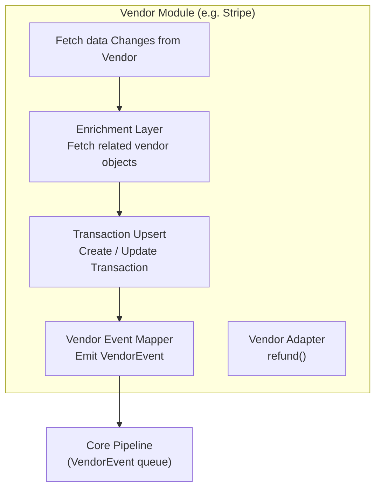
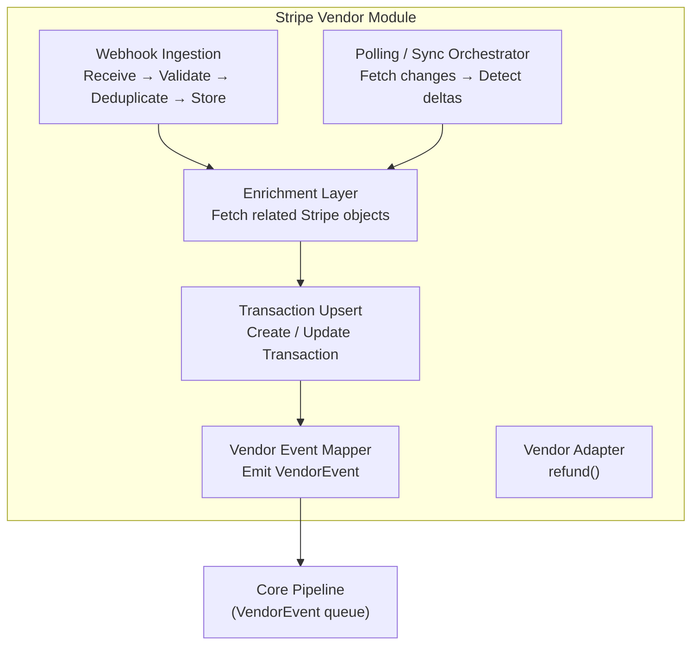
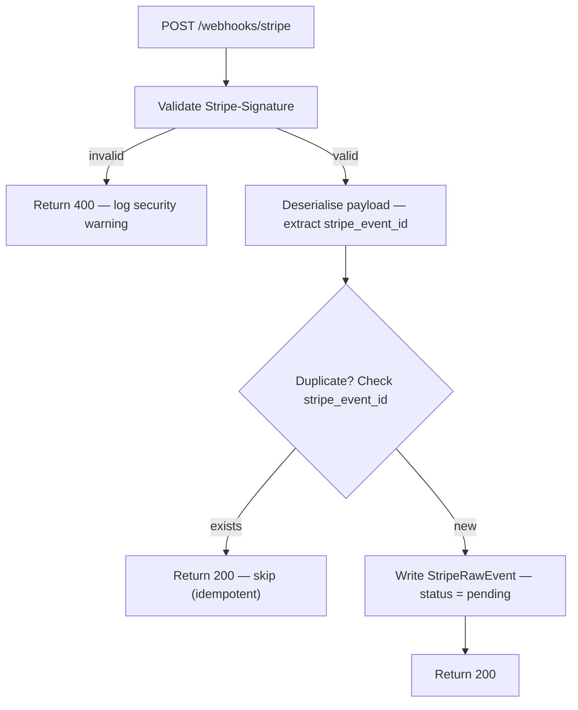

# Gringotts — Vendor Integration

## Purpose

Gringotts integrates with multiple external payment vendors — **Stripe** (online card), **CheckAlt** (check/ACH), **Courts**, and **Leo** (in-person). Each vendor has its own event model, API conventions, and data shapes.

Without a dedicated integration layer, vendor-specific logic would leak into the core domain. The Vendor Integration Layer isolates all of this behind a shared interface. The core pipeline operates entirely on normalised `Transaction` and `VendorEvent` objects — it has no vendor imports.

**Adding a new vendor means implementing the pipeline below. Nothing in the core changes.**

---

## Vendor Module Pipeline

Every vendor module is an independent implementation of the same internal pipeline. Signals enter through two paths (webhooks or polling), pass through enrichment and transaction upsert, and exit as a `VendorEvent` into the core pipeline.

---

## Pipeline Stages

### 1. Webhook Ingestion

Receives inbound vendor signals (HTTP webhooks, SFTP file drops), validates them, and stores them durably before any processing begins.

**Rules:**
- Always return immediately to the vendor — ingestion never blocks on processing
- Deduplicate using the vendor-provided signal ID (e.g. `stripe_event_id`) — identical IDs return 200 and skip
- Store with `processing_status = pending` for the enrichment layer to pick up asynchronously
- Invalid signatures are rejected with 400 and logged as security warnings

**Stored model (example — StripeRawEvent):**

| Field | Type | Notes |
|---|---|---|
| `stripe_raw_event_id` | string | Internal ID |
| `stripe_event_id` | string | Stripe's `evt_xxx` — deduplication key |
| `event_type` | string | e.g. `payment_intent.succeeded` |
| `payload` | JSON | Full raw webhook body |
| `received_at` | timestamp | |
| `processing_status` | enum | `pending`, `processing`, `processed`, `failed`, `skipped` |
| `processed_at` | timestamp | |
| `error_message` | string | Populated on failure |
| `retry_count` | int | Incremented on each failed attempt |

---

### 2. Polling / Sync Orchestrator

Periodically fetches state from the vendor API and detects changes that were not delivered by webhooks. Webhooks are not exhaustive — settlement can lag by days, dispute outcomes arrive on irregular schedules, and polling-based vendors (e.g. CheckAlt) have no webhooks at all.

**Design:**
- Runs on a configurable, per-synchroniser schedule
- Each synchroniser is responsible for one type of vendor object (charges, disputes, refunds)
- Fetches latest state from vendor, compares against local records, and forwards any delta into the Enrichment Layer
- Synchronisers are independently schedulable (e.g. settlement hourly, disputes daily)

Both Webhook Ingestion and the Sync Orchestrator feed into the **same Enrichment Layer** — there is no separate processing path for polled vs pushed signals.

---

### 3. Enrichment Layer

Fetches all related vendor objects needed to fully understand the signal. Webhooks often carry only a minimal payload; enrichment fills the gaps.

**Design:**
- Pluggable set of enrichers, each fetching one type of vendor data (e.g. balance transaction, charge details, dispute evidence)
- Enrichers accumulate results into a shared `event_context` passed through the pipeline
- Adding new enrichment = adding a new enricher; the processor itself doesn't change
- Enrichment failures are retried with backoff; signals exceeding max retries are marked `failed` and flagged for triage

---

### 4. Transaction Upsert

Creates or updates the internal `Transaction` record against the vendor transaction.

- If a `Transaction` already exists for this vendor reference, it is updated with any new data from enrichment
- If no `Transaction` exists, a new one is created with the payment breakdown and item allocations
- This stage ensures there is always a clean, vendor-agnostic `Transaction` before emitting a `VendorEvent`

---

### 5. Vendor Event Mapper

Maps the enriched context and transaction to a `VendorEventType` and emits a `VendorEvent` into the core pipeline.

- Translates vendor-specific event types to the internal `VendorEventType` enum
- Attaches the `Transaction`, `Cart` (if known), and `payment_mode` to the event
- Sets `processing_status = processed` on the raw signal after successful emit
- The emitted `VendorEvent` is the only thing the core pipeline ever sees — it has no visibility into the stages above

---

### 6. Vendor Adapter

A separate, on-demand path used by business logic to invoke vendor operations directly (e.g. issuing a refund). Not part of the inbound signal pipeline.

---

## Stripe Implementation

### Architecture Overview

### Webhook Handler

### Stripe Event → VendorEventType Mapping

| Stripe Event | VendorEventType |
|---|---|
| `payment_intent.payment_failed` | *(no VendorEvent — logged only)* |
| `payment_intent.succeeded` | `payment_confirmed` |
| `charge.succeeded` / balance transaction settled | `payment_settled` |
| `charge.refunded` | `payment_refunded` |
| `charge.dispute.created` | `payment_dispute_created` |
| `charge.dispute.funds_withdrawn` | `payment_dispute_funds_withdrawn` |
| `charge.dispute.funds_reinstated` | `payment_dispute_funds_returned` |
| `charge.dispute.closed` (lost) | `payment_dispute_lost` |

---

## Other Vendors

### Leo (In-Person)

In-person payments are recorded by LEOs via the Internal Support API ("Mark as Paid"). The API creates a `VendorEvent` directly rather than going through Signal Ingestion. Processing is asynchronous — the LEO sees "payment record update requested" immediately and the core pipeline processes the event in the background.

---

## Success Metrics

| Metric | Description |
|---|---|
| **Signal processing lag** | Time between signal receipt and VendorEvent emission, per vendor |
| **Failed event rate** | Count of signals stuck in `failed` status requiring manual intervention |
| **Enrichment error rate** | Rate of vendor API failures during the enrichment pipeline |
